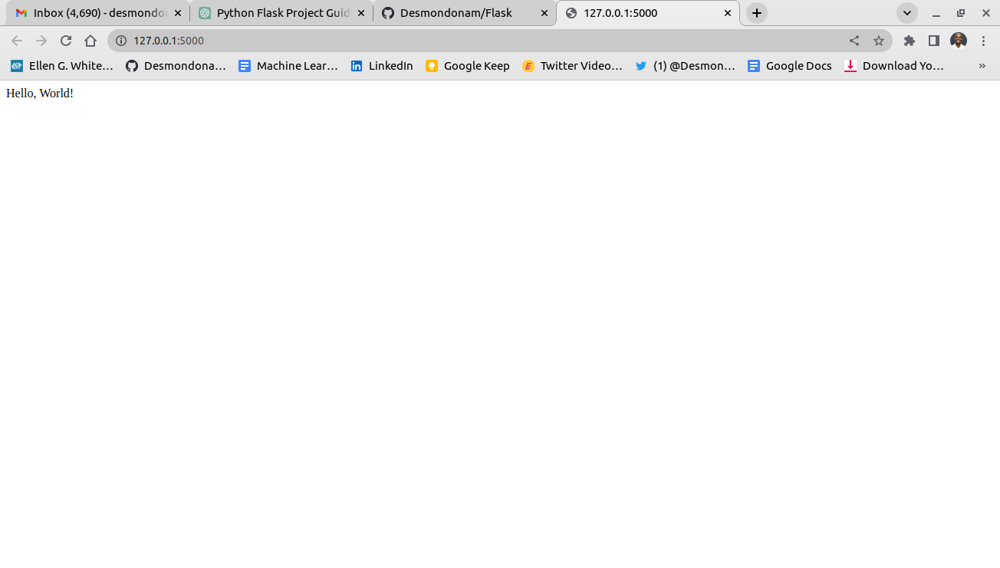

# Flask

## Step 1: Installation and Setup

To begin, you'll need to install Python on your system if you haven't already. Visit the official Python website (https://www.python.org) and download the latest version compatible with your operating system.

Once Python is installed, you can install Flask using the following command in your terminal or command prompt:

-- pip install flask

After there you can create an python file like app.py and then you can begin to create an application in flask.

## For Machine Learning purposes, try and create these 10 projects that can boost your portfolio

**1. Image Classification Web App**: Build a Flask application that allows users to upload an image, which is then classified using a pre-trained machine learning model. Display the classification results on the web page.

**2. Sentiment Analysis Tool**: Create a Flask application that takes user input, such as text or social media posts, and performs sentiment analysis using a trained model. Display the sentiment score or label on the web page.

**3. Spam Email Classifier**: Develop a Flask app that accepts email text as input and predicts whether the email is spam or not using a machine learning model. Provide the classification result to the user.

**4. Text Summarization Tool**: Build a Flask application that accepts a long text document as input and generates a summarized version using techniques like extractive or abstractive summarization.

**5. Recommendation System**: Create a Flask app that recommends products, movies, or other items based on user preferences or past behavior. Use machine learning algorithms, such as collaborative filtering or content-based filtering, to provide personalized recommendations.

**6. Fraud Detection Dashboard**: Develop a Flask application that provides a user interface to monitor and analyze fraudulent activities. Display real-time fraud detection alerts, statistical reports, and visualizations to aid in fraud analysis.

**7. Time Series Forecasting**: Build a Flask app that takes time series data as input and performs forecasting using machine learning algorithms, such as ARIMA or LSTM. Display the predicted values and visualize the forecasted trends.

**8. Chatbot Interface**: Create a Flask application that interacts with a chatbot model. Users can input queries, and the chatbot will respond with appropriate answers or suggestions. Enhance the chatbot's functionality by integrating it with external APIs.

**9. Document Classification System**: Develop a Flask app that classifies documents, such as news articles or legal documents, into predefined categories. Users can upload documents, and the app will assign relevant categories based on machine learning models.

**10. Image Captioning Web App**: Build a Flask application that accepts an image as input and generates a descriptive caption for the image using image captioning models. Display the image along with the generated caption on the web page.

Remember to showcase your code quality, documentation, and any additional features you incorporate into these applications to make them stand out in your portfolio. These projects will help demonstrate your skills in building machine learning applications with Flask.
